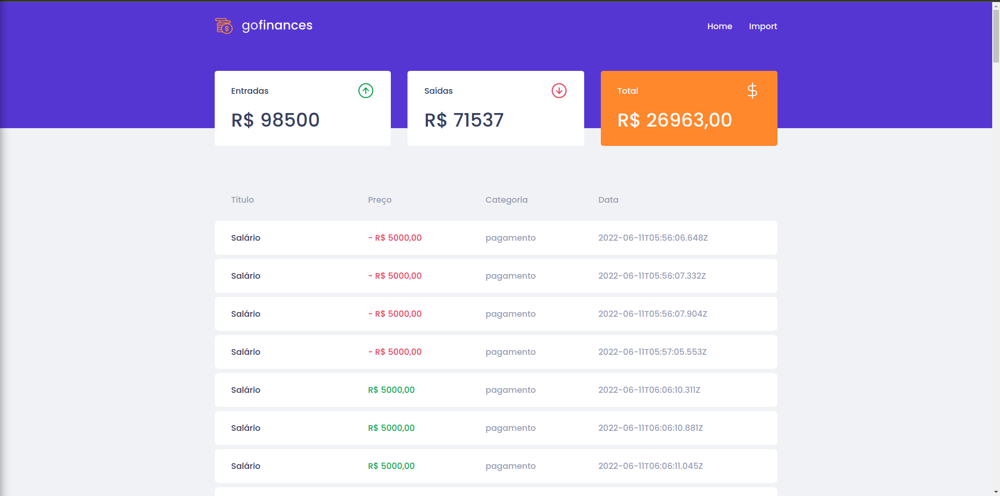
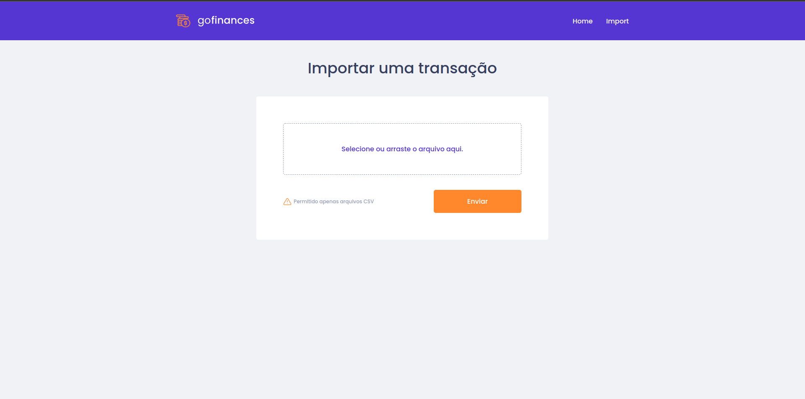

# Challenge 07 

In this challenge, the goal's to consume the api created in challenge 06 using React and show my knowledge about TypeScript, using rotes and sending files using form. The application returns transaction data, account balance and it is possible to import a csv file containing the data.

## Preview

## Challenges

- [x] - should be able to list the total balance inside the cards

- [x] - should be able to list the transactions

- [x] - should be able to navigate to the import page

- [x] - should be able to upload a file

