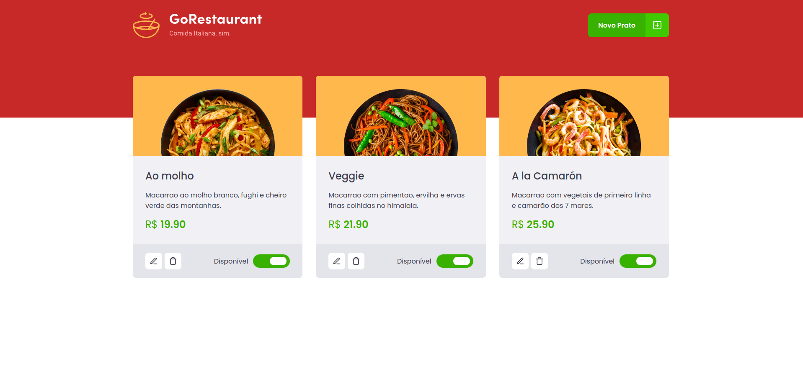
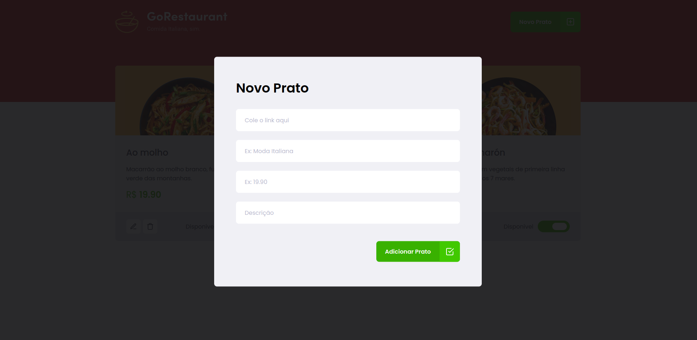
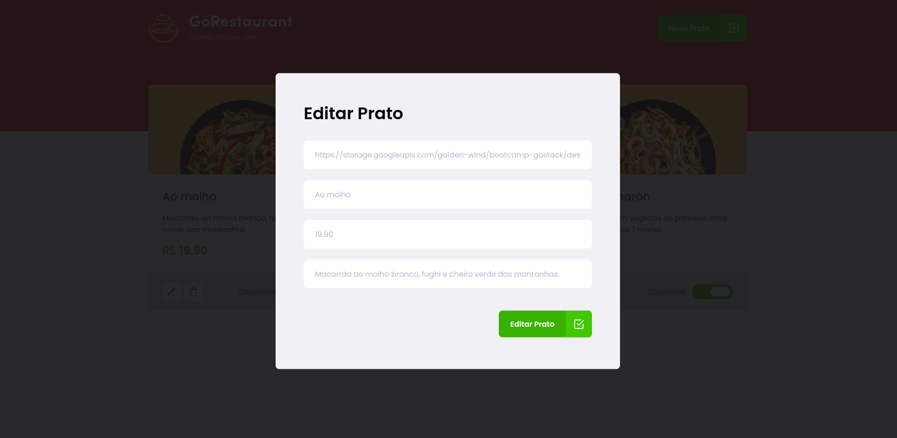

# Challenge 10

In this challenge, the goal's to consume a fake api (that simules a restaurant) and made a CRUD in React, for praticse this skills.

## Preview

## Challenges

- [x] - should be able to list all the food plates from your api

- [x] - should be able to add a new food plate

- [x] - should be able to edit a food plate

- [x] - should be able to remove a food plate

- [x] - should be able to update the availibility of a food plate
